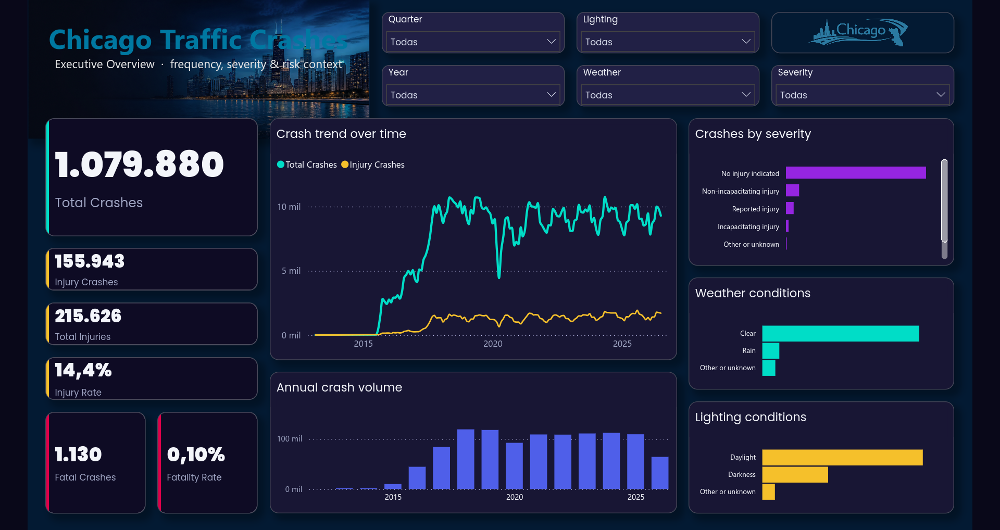

# Chicago Traffic Crashes Analytics

An end-to-end analytics project based on the City of Chicago Traffic Crashes dataset.

The project starts as a statistical analysis in Python and is being extended into a small analytics platform using BigQuery, dbt and Power BI.

## Project layers

```text
CSV source → Cloud Storage → BigQuery raw → dbt staging/marts → Python + Power BI
```

- **Python notebook:** descriptive statistics, probability and statistical inference.
- **BigQuery:** cloud warehouse for the raw and curated data.
- **dbt:** SQL transformations, data tests, documentation and lineage.
- **Power BI:** executive-facing dashboard and visual reporting.

## Business Intelligence dashboard

The completed Power BI report is included as a source-controlled PBIP project
under `bi/`. It contains three synchronized pages covering executive crash
volume, environmental risk factors, and geographic hotspots across Chicago.



- [Business Intelligence layer](bi/README.md)
- [Power BI dashboard documentation](<bi/Traffic Crashes Dashboard/README.md>)
- [View the interactive Power BI report](https://app.powerbi.com/view?r=eyJrIjoiNWI2MjVlYTktMzhkOC00MTkyLTg1ZDEtN2NmYWI5ZDI2MTQ1IiwidCI6ImM1NWUwZDRlLTM4YmQtNDllZS1hZGE0LWIzYzQ1MWI0NWU2MyIsImMiOjR9)

## Repository structure

```text
data/       Local data landing-zone documentation
bi/         Power BI report and Business Intelligence documentation
dbt/        dbt project, models, tests and configuration examples
docs/       Architecture and setup documentation
notebooks/  Exploratory and statistical analysis notebooks
scripts/    Repeatable local utilities and ingestion helpers
sql/        Standalone BigQuery SQL
```

The source CSV is intentionally excluded from Git because it is a large raw asset. See [`docs/data_platform_setup.md`](docs/data_platform_setup.md) for the planned ingestion workflow.

## Current status

- Original descriptive and probabilistic analysis completed.
- Phase 1: data quality, derived variables and comparative risk metrics completed.
- Phase 2: chi-square tests, Cramér's V and confidence intervals completed.
- Warehouse foundation: repository structure and documentation initialized.
- BigQuery ingestion: raw table loaded and validation checks passed.
- dbt staging: source, typed staging view, documentation and 24 passing tests completed.
- dbt Gold layer: star schema with four dimensions, one crash fact table and
  three Power BI-ready marts in `traffic_crashes_analytics`.
- dbt validation: full build completed successfully with 9 models and 80
  passing data tests.
- Power BI: three-page PBIP dashboard integrated under `bi/`, consuming the
  BigQuery Gold fact table and conformed dimensions.

## Local notebook

Install the analytical dependencies with:

```bash
pip install -r requirements.txt
```

Then authenticate with Google Application Default Credentials, select the
project virtual environment as the notebook kernel and run
[`notebooks/chicago_traffic_crashes_analysis.ipynb`](notebooks/chicago_traffic_crashes_analysis.ipynb):

```bash
gcloud auth application-default login
```

The notebook now reads a narrow analytical extract from the BigQuery Gold
layer. It does not reload or clean the raw CSV; those responsibilities belong
to the ingestion and dbt workflows.

## BigQuery raw ingestion

The source CSV is already staged in Cloud Storage. To create the raw BigQuery
table locally, first create a private configuration file and review its values:

```bash
cp .env.example .env
bash scripts/load_raw_bigquery.sh
```

The loader uses the explicit schema in `schemas/traffic_crashes_raw.json` and
automatically runs the read-only checks in `sql/validation/`. See
[`scripts/README.md`](scripts/README.md) and
[`docs/data_platform_setup.md`](docs/data_platform_setup.md) for the command
explanations and troubleshooting flow.

The dbt staging workflow is documented in
[`docs/dbt_workflow.md`](docs/dbt_workflow.md). Install its adapter separately
when working with the warehouse:

```bash
pip install -r requirements-dbt.txt
```
