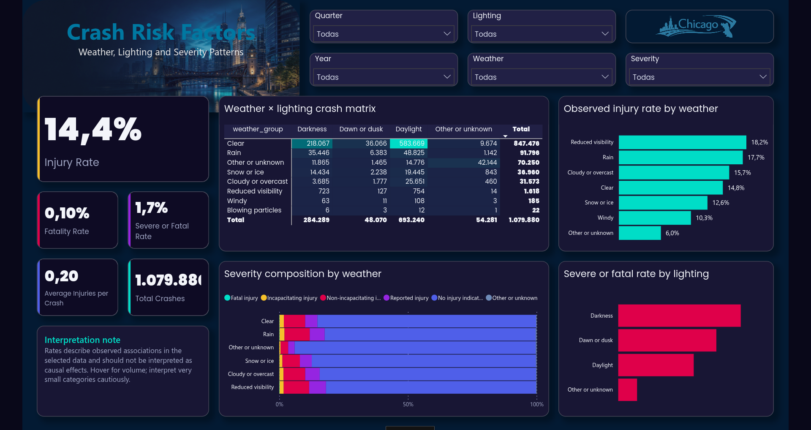
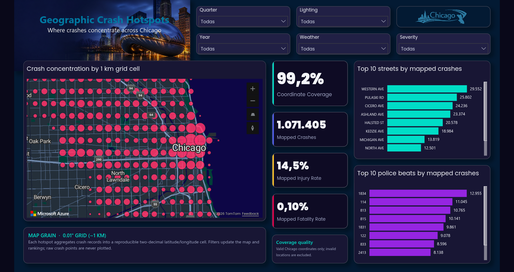

# Chicago Traffic Crashes — Power BI Dashboard

Power BI is the interactive Business Intelligence layer of this project. The
report consumes curated analytical tables from BigQuery and exposes a focused,
three-page view of crash volume, harm, environmental context, and geographic
concentration across Chicago.

## Live dashboard

[View the interactive Power BI report](https://app.powerbi.com/view?r=eyJrIjoiNWI2MjVlYTktMzhkOC00MTkyLTg1ZDEtN2NmYWI5ZDI2MTQ1IiwidCI6ImM1NWUwZDRlLTM4YmQtNDllZS1hZGE0LWIzYzQ1MWI0NWU2MyIsImMiOjR9)

This is a public portfolio publication built from public City of Chicago data.
No credentials, tokens, or private business data are included in the report.

## Architecture

```text
City of Chicago dataset
        ↓
Cloud Storage
        ↓
BigQuery raw layer
        ↓
dbt staging and Gold models
        ↓
Power BI Import
        ↓
Semantic model
        ↓
Explicit DAX measures
        ↓
Interactive report
```

The report connects to the `traffic_crashes_analytics` dataset in the
`traffic-crashes-warehouse` BigQuery project through the Power BI BigQuery
connector and Import mode.

## Semantic model

The model follows a star-schema pattern:

- `fct_traffic_crashes` is the central fact table at one row per crash.
- `dim_date` provides calendar filtering and time-series context.
- `dim_weather` provides grouped weather conditions.
- `dim_lighting` provides grouped lighting conditions.
- `dim_severity` provides severity categories and severity ordering.
- `Dashboard Measures` is a hidden utility table containing explicit DAX
  measures grouped by volume, harm, rates, severity, environmental context, and
  geography.

Relationships flow from the conformed dimensions to the fact table. Technical
keys are hidden from report users while remaining available to the model.
Aggregate marts are part of the wider warehouse design, but the current report
semantic model intentionally uses the fact table and conformed dimensions so
the shared slicers behave consistently across all three pages.

## Report pages

### 1. Executive Overview

Provides a high-level view of the selected crash population, including:

- Total crashes and injury-related KPIs.
- Crash and injury trends over time.
- Annual crash volume.
- Severity distribution.
- Weather and lighting context.
- Shared Year, Quarter, Weather, Lighting, and Severity filters.


### 2. Crash Risk Factors

Examines observed associations between environmental conditions and crash
outcomes:

- Injury rate, fatality rate, and severe-or-fatal rate.
- Weather-by-lighting crash matrix with conditional intensity formatting.
- Severity composition by weather group.
- Observed injury rate by weather.
- Observed severe-or-fatal rate by lighting.
- Tooltips that keep category volume available alongside rates.

The page uses descriptive language. Rates describe associations in the selected
data and should not be interpreted as causal effects.



### 3. Geographic Crash Hotspots

Highlights where mapped crashes concentrate across Chicago:

- Azure Maps bubble map centered on Chicago.
- Two-decimal latitude/longitude grid, approximately 1 km per cell.
- Mapped crash volume represented by bubble size.
- Coordinate coverage and mapped harm KPIs.
- Dynamic Top 10 streets by mapped crashes.
- Dynamic Top 10 police beats by mapped crashes.
- Shared filters across time, weather, lighting, and severity.

The map aggregates records into grid cells rather than plotting raw crash
points. This reduces overplotting and makes the geographic grain explicit. The
map is a proportional-symbol map; circle size represents mapped crash volume.



## Power BI capabilities demonstrated

- PBIP/PBIR project format for source-controlled report artifacts.
- TMDL semantic model definitions.
- BigQuery Import-mode connectivity.
- Star-schema relationships and conformed dimensions.
- Explicit DAX measures rather than implicit aggregations.
- Synchronized interactive slicers.
- Conditional formatting in matrix and categorical visuals.
- Cross-filtering and drill interactions.
- Native Power BI charts and Azure Maps.
- Custom report theme and registered image resources.
- Three-page report design with consistent visual identity.
- Geographic aggregation and coordinate-quality reporting.

## Local usage

Open [`Traffic Crashes Dashboard.pbip`](<Traffic Crashes Dashboard.pbip>) with a
Power BI Desktop version that supports PBIP projects.

To refresh the report locally, the user needs:

- Access to the `traffic-crashes-warehouse` Google Cloud project.
- Permission to query the `traffic_crashes_analytics` BigQuery dataset.
- Google OAuth authentication configured in Power BI.
- Network access to the BigQuery connector and Azure Maps visual.

The repository does not store credentials or local Power BI cache files. The
published link above can be used as a dashboard demo without running the local
warehouse or notebook.

## Project files

- `Traffic Crashes Dashboard.pbip`: PBIP entry point.
- `Traffic Crashes Dashboard.Report/`: pages, visuals, report settings, theme
  references, and registered report resources.
- `Traffic Crashes Dashboard.SemanticModel/`: TMDL model, tables, measures,
  relationships, and model layout.
- `assets/`: source design assets retained for report maintenance.

Local Desktop state and caches under `.pbi/` are intentionally excluded from
version control by the root `.gitignore`.

## Limitations and interpretation

- The dataset represents reported traffic crashes, not a complete measure of
  exposure or traffic volume.
- Geographic results are aggregated to an approximately 1 km grid and should
  not be interpreted as exact crash-point locations.
- Categories with missing or unknown values are retained where possible and
  should be interpreted separately from known conditions.
- Rates are descriptive statistics for the selected data and do not establish
  causality.
